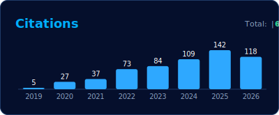

AI scientist and engineer working at the frontier of research and business. PhD and 8+ years of applied AI/ML experience, currently focusing on generative and agentic AI. Designing and building end-to-end AI solutions that drive business impact across diverse industries. Active author and speaker with 15 scientific papers and 30+ talks across industry and academia.

